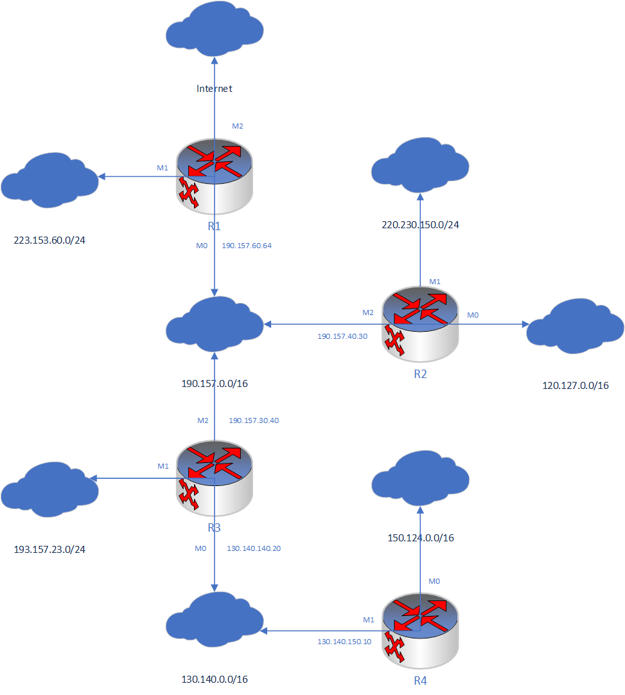
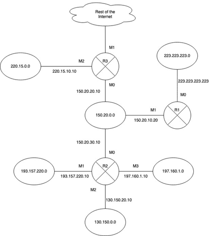

# CS 542 – Computer Networks I: Fundamentals Fall 2022 HW1 (84 points)

---

1. Convert an IP address given as 0xB3A74104 to the dotted decimal notation. What is the class of this address? (3 points)

    ```c
    Solution:
    1.  0xB3A74104 Convert hexadecimal to binary
        hex:  0xB3A74104
        bin:  1011 0011, 1010 0111, 0100 0001, 0000 0100
        Convert binary to decimal
        dec:  179.167.65.4
        so, the IP address given as 0xB3A74104 to the dotted decimal notation is: 179.167.65.4 

    2. Get the highest 4 bits of the IP addresses:
        0xB3A74104 >> 28 = 0xB = 11

       As 8 < 11 < 12, this IP address (179.167.65.4) is a class B address.
    ```

2. Consider a host whose address is 138.147.48.67/19 (4 points)
    a. What is the network address?
    b. How many addresses can be assigned to hosts in this network?
    c. What is the first available address that can be assigned to a host?
    d. What is the last available address that can be assigned to a host?

    ```c
    Solution:
    a. 138.147.48.67/19, the leading 19 bits should be network address, so network addr = 138.147.32.0
    b. host addr bits: 32 - 19 = 13 bits, the 1st address is network and last is broadcast address.
       so the addresses for hosts is 2^13 -2 = 8190.
    c. the firs host: 138.147.32.1
    d. the last host: 138.147.63.254
    ```

3. An organization is granted the block 135.34.212.0/22. The network administrator wants to create 32 subnets. (6 points)
    a. Find the subnet mask. (1 point)
    b. Find the number of addresses in each subnet. (1 point)
    c. Find the subnet address and the direct broadcast address for the 5th subnet.  (2 points)
    d. Find the 9th address and the next to last address in the 31st subnet. (2 points)

    ```c
    Solution:
    a. 135.34.212.0/22, the leading 22bits should be the network address. 32 subnets should be 5bits. 
       So the subnet address should be 135.34.212.0/27. So,
       the subnet mask for block is 255.255.252.0.
       the subnet mask for 32 subnets is 255.255.255.224.
    b. the number of addresses in each subnet = 2^(32-27) = 32.
    c. Since the 1st subnet address = 135.34.212.0/27,
       the network address for the 5th subnet = 135.34.212.128/27,
       the broadcast address = 135.34.212.159/27
    d. Since the 1st subnet address = 135.34.212.0/27, the 31st subnet = 135.34.215.192/27. ???
       So the 9th address in the 31st subnet = 135.34.215.200.
       the last address = 135.34.215.223, the next to last address in the 31st subnet = 135.34.215.222.
    ```

4. Give the mask in the dotted-decimal notation: (3 points)
    a. For a block of class A which results in 1024 subnets.
    b. For a block of class B which results in 512 subnets.
    c. Which combines 256 blocks of Class B into a supernet.

    ```c
    Solution:
    a. class A should have 8 bits network address, 1024 subnets need 10bits subnet bits, 
       so the mask should be 18bits 1s: 0xFFC0_0000 = 255.192.0.0
    b. class B should have 16bits network address, 512 subnets need 9bits subnet bits, 
       so the mask should be 25bits 1s: 0xFFFF_FF80 = 255.255.255.128
    c. class B should have 16bits network address, 256 blocks need 8bits subnet bits, 
       so the mask should be 8bits 1s: 0xFF00_0000 = 255.0.0.0
    ```

5. The network 127.154.24.0/21 is divided into 32 subnets. Can the following IP addresses be assigned to hosts? Explain your answers. (5 points)
    a. 127.154.24.0
    b. 127.154.24.128
    c. 127.154.25.120
    d. 127.154.31.255
    e. 127.154.30.250

    ```c
    Solution:
    Since network 127.154.24.0/21 has 32 subnets, if the subnet is divided equally, the subnet address should be 127.154.24.0/26.
    Specially, if the subnet is not divided equally, there is possibility to get another result for some IP addresses.

    a. 127.154.24.0 is the network address of the 1st subnet, it cannot be a host address regardless of how the subnet is divided.

    b. If the subnet is divided equally, 127.154.24.128 is the network address of the 3rd subnet, it cannot be a host address.
       If the subnet is not divided equally, for example, the 1st subnet is 127.154.24.0/24, then it can be a host address.

    c. If the subnet is divided equally, 127.154.25.120 is in the 6th subnet, it can be a host address.
       If the subnet is not divided equally, for example, there is a subnet 127.154.25.120/29, it cannot be a host address.

    d. If the subnet is divided equally, 127.154.31.255 is the broadcast address of the 32nd subnet, it cannot be a host address.
       Even if the subnet is not divided equally, this address is the last address of the whole block, it still cannot be a host address.

    e. If the subnet is divided equally, 127.154.30.250 is in the 28th subnet, it can be a host address.
       If the subnet is not divided equally, for example, there is a subnet 127.154.30.250/31, it cannot be a host address.
    ```

6. A network of Class A has a subnet mask 255.224.0.0. What is the maximum number of hosts in each subnet? (2 points)

    ```c
    Solution:
    Subnet mask 255.224.0.0 has 11 bits leading 1s. So the bits for hosts is 32 - 11 = 21 bits.
    the address in each subnet = 2^21 = 2M = 2097152
    Hosts should not use the network address and broadcast address.
    So the maximum number of hosts = 2097152 - 2 = 2097150
    ```

7. Convert the decimal number 275820.0157470703125 to a base 256 number. (4 points)

    ```c
    Solution:
    275820 / 256 = 1077 ... 108
    1077 / 256 = 4 ... 53
    So the integer part is (4.53.108)
    0.0157470703125 * 256 = 4.03125 ... 4
    0.03125 * 256 = 8
    So the decimal part is (4.8)
    ```

    Finally, 275820.0157470703125 = (4.53.108,4.8)<sub>256</sub>

8. What is the value of the following division $\frac{14.175.105.126.0}{2.25.15.18}$ (all the numbers are given in the base 256 system) ? Give the result as a base 256 number. Don’t use decimal or binary systems in your calculations. (4 points)

    Solution:
    $\qquad\qquad\qquad\qquad\qquad\ \ \ 7.0$
    $2.25.15.18 /\overline {14.175.105.126.0}$
    $\qquad\qquad\ \ \ \ \ \, \underline {14.175.105.126}$
    $\qquad\qquad\qquad\qquad\qquad\ \ \ \ \ \ \ 0$

    So, $\frac{14.175.105.126.0}{2.25.15.18} = (7.0)_{256}$

9. Find the 2149th address and the last address of the block 123.0.0.0/18. (3 points)

    ```c
    Solution:
    the host address of the 2149th address = 2148 = 0x8_64
    so the address of the 2149th address = 123.0.8.100

    The block 123.0.0.0/18 has 32-18 = 14bits host address. The last address should be all 1s in last 14bits.
    So the last address of the 2149th address = 123.0.63.255
    ```

10. The addresses of two hosts in a certain network are 187.93.25.97 and 187.93.127.230. Assume classful addressing. How many addresses are there: (2 points)
    a. Between these two addresses?
    b. In the entire network?

    ```c
    Solution:
    Since 187.93.25.97 is typically class B address, its mask should be 16 bits and hosts address 16 bits.
    a. the addresses between them = 187.93.127.230 - 187.93.25.97 - 1 = 0x7FE6 - 0x1961 - 1 = 26244
    b. Since the network has 16 bits host address, the total address number = 2^16 = 65536
    ```

11. A block of addresses 146.157.224.0/19 was granted to an ISP. These addresses were allocated to three groups of customers. Subblock #1 was allocated to the 1st group of 20 customers, each of which needs 126 assignable addresses. Subblock #2 was allocated to the 2nd group of 15 customers, each of which needs 126 assignable addresses. Subblock #3 was allocated to the 3rd group of 12 customers, each of which needs 64 addresses. Find the subblocks, masks and range of addresses for: (13 points)
    a. subblock #1 (2 points)
    b. subblock #2 (2 points)
    c. subblock #3 (2 points)
    d. 12th customer of the 1st group (2 points)
    e. 7th customer of the 2nd group (2 points)
    f. 10th customer of the 3rd group (2 points)
    g. How many addresses are still available after this allocation? (1 point)

    ```c
    Solution:
    126 assignable addresses need 7 bits host address, while 64 addresses need 6 bits.
    146.157.224.0/19 has 19 bits network address, 
    so the 1st and 2nd group has 6 bits subnet bits, 
    the 3rd group has 7bits subnet bits.
    1st & 2nd:  19b + 6b + 7b
    3rd:        19b + 7b + 6b

    subnet number for #1 = 0_0000_0 ~ 0_1001_1
    subnet number for #2 = 0_1010_0 ~ 1_0001_0
    subnet number for #3 = 1_0001_10 ~ 1_0100_01

    a. For 1st group, 7bit host address, 20 customers, 
        subblock = 146.157.224.0/25 ~ 146.157.233.128/25
        mask 25b = 255.255.255.128
        address range = 146.157.224.0 ~ 146.157.233.255

    b. For 2nd group, 7bit host address, 15 customers
        subblock = 146.157.234.0/25 ~ 146.157.241.0/25
        mask 25b = 255.255.255.128
        address range = 146.157.234.0 ~ 146.157.241.127

    c. For 3nd group, 6bit host address, 12 customers
        subblock = 146.157.241.128/26 ~ 146.157.244.64/26
        mask 26b = 255.255.255.192
        address range = 146.157.241.128 ~ 146.157.244.127

    d. the 12th customer in 1st, the subnet number = 0_0101_1
        network = 146.157.229.128/25
        mask 25b = 255.255.255.128
        address range of subnet = 146.157.229.128 ~ 146.157.229.255

    e. the 7th customer in 2nd, the subnet number = 0_1101_0
        network = 146.157.237.0/25
        mask 25b = 255.255.255.128
        address range of subnet = 146.157.237.0 ~ 146.157.237.127

    f. the 10th customer in 3rd, the subnet number = 1_0011_11, 
        network = 146.157.243.192/26
        mask 26b = 255.255.255.192
        address range of subnet = 146.157.243.192 ~ 146.157.243.255

    g. total addresses = 2^(32-19) = 8192
       used addresses = 128 * (20 + 15) + 64 * 12 = 5248
       So available address = 8192 - 5248 = 2944
    ```

12. The 33rd address of a block allocated to an organization is 145.154.85.160. The organization needs a total of 123 addresses for hosts and 3 routers. Find the mask and define this block of addresses. Is there any wastage of the IP addresses? If yes, how many addresses are wasted? (3 points)

    ```c
    Solution:
    145.154.85.160 is a  class B network, so the mask is 16 bits.
    It is the 33rd address, so the network address is 145.154.85.160 - 32 = 145.154.85.128.
    As it is a network address, the mask should be 25bits, so the block should be 145.154.85.128/25.

    123 addresses need 7 bits for host address. the upper block can meet the requirements.
    So the block of address can be 145.154.85.128/25.

    Yes, there is some wastage of IP address.
    For 145.154.85.128/25 can provides 128 IP address, minus the network address and broadcast address, 
    it only has 126 assignable ip addresses.
    As 128 - 2 - 123 - 3 = 0, There is no waste of IP addresses.
    ```

13. Consider the following routing table (the next-hop address is omitted): (6 points)

    | Mask    | Network address | Interface |
    |---------|-----------------|-----------|
    | /25     | 187.123.224.0   | M0        |
    | /18     | 201.4.0.0       | M1        |
    | /17     | 201.4.128.0     | M2        |
    | /15     | 180.74.0.0      | M3        |
    | Default | Default         | M4        |

    Give the interface number for a packet whose destination IP address is: (Explain your answers)
        a. 187.123.224.130
        b. 187.123.224.80
        c. 201.4.223.10
        d. 180.74.235.21
        e. 180.75.25.31
        f. 180.73.40.21

    ```c
    Solution:
    Let we count the network address and ip range of each interface.
    ```

    | Interface | Network address  | ip begin      | ip end          |
    |:---------:|------------------|---------------|-----------------|
    |    M0     | 187.123.224.0/25 | 187.123.224.0 | 187.123.224.127 |
    |    M1     | 201.4.0.0/18     | 201.4.0.0     | 201.4.63.255    |
    |    M2     | 201.4.128.0/17   | 201.4.128.0   | 201.4.255.255   |
    |    M3     | 180.74.0.0/15    | 180.74.0.0    | 180.75.255.255  |
    |    M4     | Default          |               |                 |

    ```c
    So we can get the results:
    a. 187.123.224.130 -> M4, because it is out of M0's IP range and no other matches.
    b. 187.123.224.80 -> M0, as it's in the M0's IP range.
    c. 201.4.223.10 -> M2, as it's in the M2's IP range.
    d. 180.74.235.21 -> M3, as it's in the M3's IP range.
    e. 180.75.25.31 -> M3, as it's in the M3's IP range.
    f. 180.73.40.21 -> M4, because it is out of M3's IP range and no other matches.
    ```

14. The routing tables for routers R1, R2, R3 & R4 are given. Draw the network configuration with all these routers. Indicate the next-hop addresses in the figure. (12 points)

    R1:
    | Mask    | Network Address | Next-Hop Address | Interface Number |
    |---------|-----------------|------------------|------------------|
    | /24     | 223.153.60.0    | -----------      | M1               |
    | /24     | 193.157.23.0    | 190.157.30.40    | M0               |
    | /24     | 220.230.150.0   | 190.157.40.30    | M0               |
    | /16     | 150.124.0.0     | 190.157.30.40    | M0               |
    | /16     | 130.140.0.0     | 190.157.30.40    | M0               |
    | /16     | 120.127.0.0     | 190.157.40.30    | M0               |
    | /16     | 190.157.0.0     | -----------      | M0               |
    | Default | Default         | -----------      | M2               |

    R2:
    | Mask    | Network Address | Next-Hop Address | Interface Number |
    |---------|-----------------|------------------|------------------|
    | /24     | 193.157.23.0    | 190.157.30.40    | M2               |
    | /24     | 220.230.150.0   | -----------      | M1               |
    | /16     | 150.124.0.0     | 190.157.30.40    | M2               |
    | /16     | 130.140.0.0     | 190.157.30.40    | M2               |
    | /16     | 120.127.0.0     | -----------      | M0               |
    | /16     | 190.157.0.0     | -----------      | M2               |
    | Default | Default         | 190.157.60.64    | M2               |

    R3:
    | Mask    | Network Address | Next-Hop Address | Interface Number |
    |---------|-----------------|------------------|------------------|
    | /24     | 193.157.23.0    | -----------      | M1               |
    | /24     | 220.230.150.0   | 190.157.40.30    | M2               |
    | /16     | 150.124.0.0     | 130.140.150.10   | M0               |
    | /16     | 130.140.0.0     | -----------      | M0               |
    | /16     | 120.127.0.0     | 190.157.40.30    | M2               |
    | /16     | 190.157.0.0     | -----------      | M2               |
    | Default | Default         | 190.157.60.64    | M2               |

    R4:
    | Mask    | Network Address | Next-Hop Address | Interface Number |
    |---------|-----------------|------------------|------------------|
    | /16     | 150.124.0.0     | -----------      | M0               |
    | /16     | 130.140.0.0     | -----------      | M1               |
    | Default | Default         | 130.140.140.20   | M1               |

    Solution:
      

15. Consider the network configuration given below. Assume classful addressing. (14 points)
    a. Are there any errors in this network configuration. If so, correct them. (2 points)
    b. Create routing tables for routers R1, R2 and R3 (9 points)
    c. A packet with the destination address 130.150.30.25 has arrived at router R3. Explain how this packet will reach its final destination. (3 points)

      

    ```c
    Solution:
    a. M2 should be 220.15.0.10. 
       Because 220.15.10.10 as a class C IP address whose network address should be 220.15.10.0. It is not in 220.15.0.0 network. 
       The network would be unreachable.

    b. Route Tables
    ```

    R1:
    | Mask    | Network Address | Next-Hop Address | Interface Number |
    |---------|-----------------|------------------|------------------|
    | /16     | 150.20.0.0      | ------           | M1               |
    | /16     | 130.150.0.0     | 150.20.30.10     | M1               |
    | /24     | 223.223.223.0   | ------           | M0               |
    | /24     | 220.15.0.0      | 150.20.20.10     | M1               |
    | /24     | 193.157.220.0   | 150.20.30.10     | M1               |
    | /24     | 197.160.1.0     | 150.20.30.10     | M1               |
    | Default | Default         | 150.20.20.10     | M1               |

    R2:
    | Mask    | Network Address | Next-Hop Address | Interface Number |
    |---------|-----------------|------------------|------------------|
    | /16     | 150.20.0.0      | -------          | M0               |
    | /16     | 130.150.0.0     | -------          | M2               |
    | /24     | 193.157.220.0   | -------          | M1               |
    | /24     | 197.160.1.0     | -------          | M3               |
    | /24     | 223.223.223.0   | 150.20.10.20     | M0               |
    | /24     | 220.15.0.0      | 150.20.20.10     | M0               |
    | Default | Default         | 150.20.20.10     | M0               |

    R3:
    | Mask    | Network Address | Next-Hop Address | Interface Number |
    |---------|-----------------|------------------|------------------|
    | /16     | 150.20.0.0      | -------          | M0               |
    | /16     | 130.150.0.0     | 150.20.30.10     | M0               |
    | /24     | 220.15.0.0      | -------          | M2               |
    | /24     | 223.223.223.0   | 150.20.10.20     | M0               |
    | /24     | 193.157.220.0   | 150.20.30.10     | M0               |
    | /24     | 197.160.1.0     | 150.20.30.10     | M0               |
    | Default | Default         | -------          | M1               |

```c
    c. A packet with address 130.150.30.25.

        1. R3 figure out the network address of destination. It is a class B IP, the network addr = 130.150.0.0/16.
        2. R3 check the route table if any item matches. The item 4 matches.
        3. R3 send out through M0 interface to R2 according to the route table.
        4. R2 receive the packet and figure out the network address of destination. ip = 130.150.0.0/16.
        5. R2 check its route table and find the item 3 matches.
        6. R2 send out the packet through M2 to the destination network.
```
